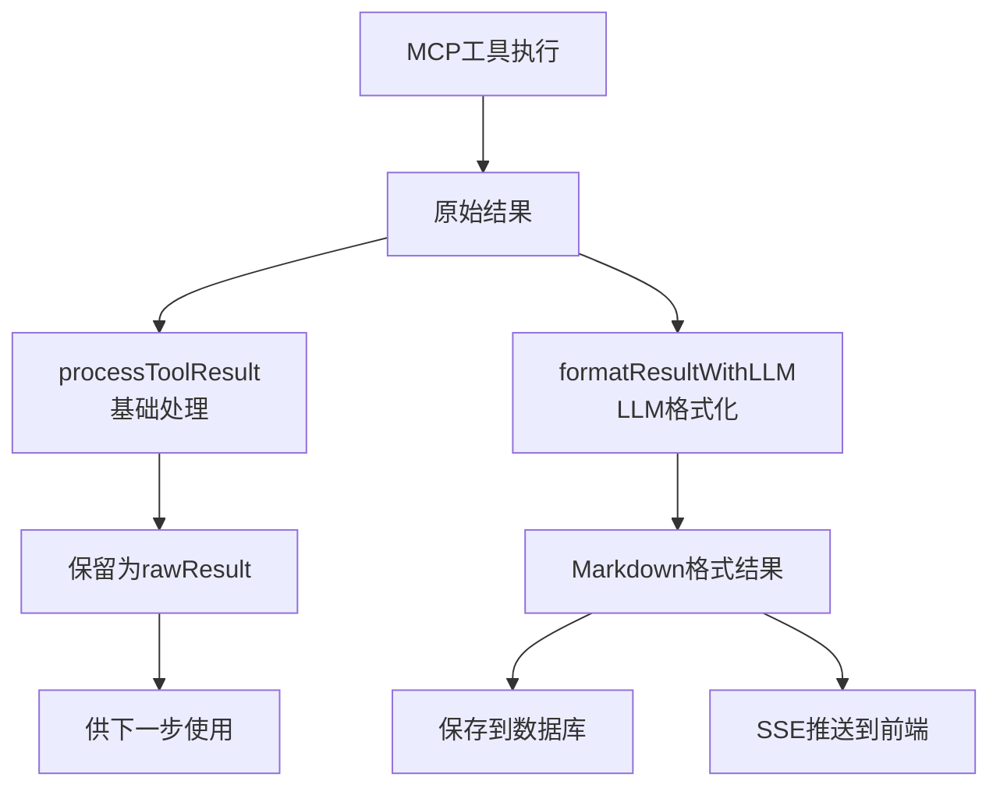

# 格式化执行输出功能说明

## 概述

在 `execute/stream` 接口中，我们新增了使用 LLM 自动格式化 MCP 返回结果的功能。该功能将原始的、难以理解的 MCP 输出转换为易读的 Markdown 格式，大大提升了用户体验。

## 功能特点

### 1. 智能格式化
- 使用 LLM 分析原始输出，提取有价值的信息
- 自动识别数据类型（金融数据、列表、错误信息等）
- 生成结构化的 Markdown 格式输出

### 2. 保留原始数据
- 格式化后的结果用于展示
- 原始数据保留在 `rawResult` 字段中
- 确保数据完整性，支持调试和数据传递

### 3. 实时流式输出
- 每个步骤完成后立即返回格式化结果
- 支持 SSE (Server-Sent Events) 实时推送
- 前端可以实时展示执行进度和结果

## 技术实现

### 核心方法

```typescript
private async formatResultWithLLM(
  rawResult: any, 
  mcpName: string, 
  actionName: string
): Promise<string>
```

该方法负责：
1. 提取 MCP 原始响应中的实际内容
2. 构建智能提示词，指导 LLM 进行格式化
3. 返回格式化后的 Markdown 内容

### 数据流程



## 使用示例

### API 调用

```javascript
// 执行任务
const response = await fetch('/api/task/{taskId}/execute/stream', {
  method: 'POST',
  headers: {
    'Authorization': 'Bearer {token}',
    'Content-Type': 'application/json'
  }
});

// 处理 SSE 流
const reader = response.body.getReader();
const decoder = new TextDecoder();

while (true) {
  const { done, value } = await reader.read();
  if (done) break;
  
  // 解析 SSE 数据
  const chunk = decoder.decode(value);
  // 处理格式化后的结果...
}
```

### 响应格式

```json
{
  "event": "step_complete",
  "data": {
    "step": 1,
    "success": true,
    "result": "### 比特币价格数据 📊\n\n**当前价格**: $42,150.78\n**24小时涨跌**: +3.25%\n...",
    "rawResult": "{\"status\":{\"error_code\":0},...}"
  }
}
```

## 格式化规则

### 1. 金融数据
- 货币格式化：$1,234.56
- 百分比显示：+3.25%
- 使用表格展示多项数据

### 2. 列表数据
- 转换为 Markdown 列表
- 重要信息使用粗体标记
- 添加合适的表情符号

### 3. 错误处理
- 清晰说明错误原因
- 提供可能的解决方案
- 移除技术性错误代码

## 测试方法

运行测试脚本验证功能：

```bash
node test/test-formatted-execution.js
```

测试脚本会：
1. 创建测试任务
2. 执行任务并接收格式化输出
3. 对比原始输出和格式化输出
4. 验证数据完整性

## 注意事项

1. **性能考虑**：LLM 格式化会增加一定延迟，但通过流式处理最小化影响
2. **降级处理**：如果 LLM 格式化失败，会返回基础格式化的结果
3. **成本控制**：使用 gpt-4o-mini 模型平衡效果和成本

## 未来优化

1. 支持自定义格式化模板
2. 缓存常见输出的格式化结果
3. 根据 MCP 类型使用专门的格式化策略
4. 支持多语言格式化输出 