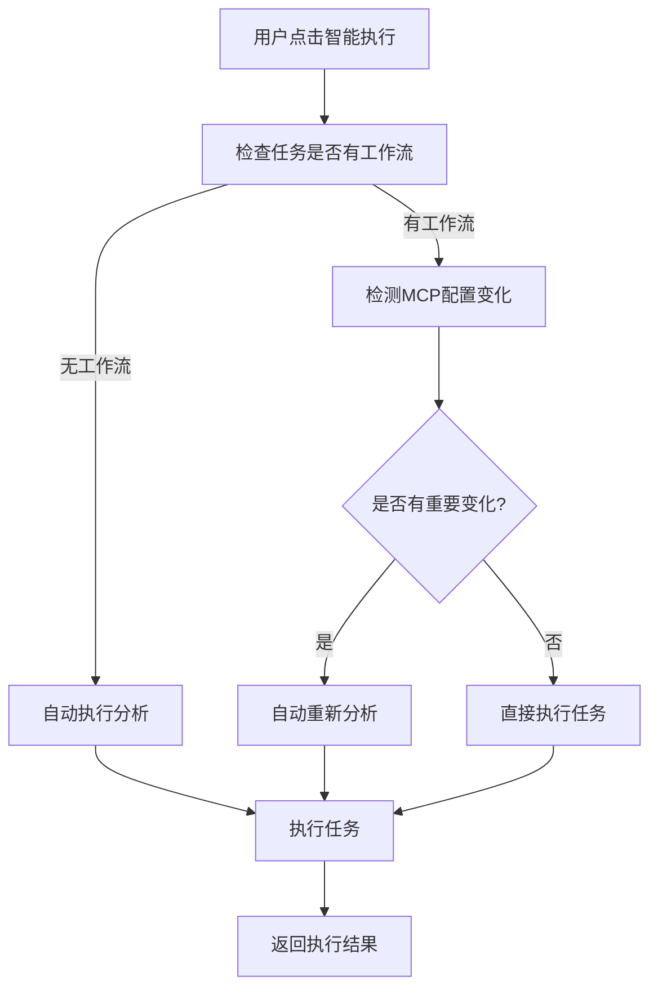

# 智能执行功能使用指南

## 概述

智能执行功能是对传统任务执行流程的重大改进，它能够自动检测用户是否修改了MCP配置，并根据检测结果决定是否需要重新分析任务，从而提供更加友好的用户体验。

## 🎯 解决的问题

### 传统流程的问题
1. **用户体验不友好**：用户切换MCP后需要手动重新分析
2. **操作步骤繁琐**：需要先重新分析，再手动执行
3. **容易出错**：用户可能忘记重新分析就直接执行

### 智能执行的优势
1. **一键执行**：用户只需点击一个按钮
2. **自动检测**：系统自动检测MCP配置变化
3. **智能决策**：根据检测结果自动决定是否重新分析
4. **无缝体验**：整个过程对用户透明

## 🔄 工作流程

### 智能执行流程图



### 详细步骤说明

#### 1. 初始检查阶段
- 检查任务是否存在
- 验证用户权限
- 检查任务是否有工作流配置

#### 2. MCP变化检测阶段
如果任务已有工作流，系统会检测：
- **认证状态变化**：MCP的认证状态是否发生变化
- **新MCP认证**：是否有新的同类别MCP被认证
- **更好的替代方案**：是否有备选MCP具有更好的认证状态

#### 3. 智能决策阶段
根据检测结果决定：
- **无变化**：直接执行任务
- **有重要变化**：自动重新分析后执行
- **检测失败**：为安全起见，重新分析后执行

#### 4. 执行阶段
- 使用最新的MCP配置执行任务
- 实时返回执行状态和结果

## 📡 API接口

### 智能执行接口

```http
POST /api/task/:id/smart-execute/stream
Authorization: Bearer <token>
Content-Type: application/json

{
  "userId": "user_id_if_not_in_token"
}
```

### 响应事件类型

#### 1. 执行开始
```json
{
  "event": "smart_execution_start",
  "data": {
    "taskId": "task_123",
    "timestamp": "2024-01-01T00:00:00.000Z",
    "message": "Starting smart execution with automatic MCP change detection..."
  }
}
```

#### 2. 检查MCP变化
```json
{
  "event": "checking_mcp_changes",
  "data": {
    "message": "Checking for MCP configuration changes..."
  }
}
```

#### 3. 检测到变化（需要重新分析）
```json
{
  "event": "mcp_changes_detected",
  "data": {
    "message": "Detected MCP configuration changes, re-analyzing task...",
    "changes": [
      {
        "type": "auth_status",
        "mcpName": "coinmarketcap-mcp-service",
        "description": "Authentication status changed from false to true",
        "oldValue": false,
        "newValue": true
      }
    ],
    "summary": "Detected 1 authentication status change(s)",
    "reason": "mcp_modified"
  }
}
```

#### 4. 无重要变化（直接执行）
```json
{
  "event": "no_changes_detected",
  "data": {
    "message": "No significant MCP changes detected, proceeding with direct execution...",
    "summary": "No MCP configuration changes detected",
    "reason": "no_changes"
  }
}
```

#### 5. 分析阶段（如果需要）
```json
{
  "event": "analysis_required",
  "data": {
    "message": "Task has not been analyzed yet, starting analysis...",
    "reason": "no_workflow"
  }
}
```

#### 6. 执行阶段开始
```json
{
  "event": "execution_phase_start",
  "data": {
    "message": "Starting task execution...",
    "timestamp": "2024-01-01T00:00:00.000Z"
  }
}
```

#### 7. 智能执行完成
```json
{
  "event": "smart_execution_complete",
  "data": {
    "taskId": "task_123",
    "message": "Smart execution completed successfully",
    "timestamp": "2024-01-01T00:00:00.000Z"
  }
}
```

## 🔍 MCP变化检测详情

### 检测类型

#### 1. 认证状态变化 (auth_status)
- **触发条件**：MCP的认证状态从未认证变为已认证，或相反
- **影响**：如果从未认证变为已认证，通常需要重新分析以利用新的MCP能力

#### 2. 新MCP认证 (new_auth)
- **触发条件**：用户认证了与任务中MCP同类别的新MCP
- **影响**：可能提供更好的功能或性能，建议重新分析

#### 3. MCP替换 (mcp_replaced)
- **触发条件**：备选MCP具有更好的认证状态
- **影响**：可以使用更可靠的MCP，建议重新分析

### 重新分析决策逻辑

系统会在以下情况下自动重新分析：
1. 任务中的MCP从未认证变为已认证
2. 发现了新的已认证的同类别MCP
3. 备选MCP的认证状态优于当前MCP

## 🎨 前端集成示例

### JavaScript集成

```javascript
async function smartExecuteTask(taskId) {
  const eventSource = new EventSource(`/api/task/${taskId}/smart-execute/stream`);
  
  eventSource.onmessage = function(event) {
    if (event.data === '[DONE]') {
      eventSource.close();
      return;
    }
    
    const data = JSON.parse(event.data);
    
    switch(data.event) {
      case 'smart_execution_start':
        console.log('🚀 智能执行开始');
        updateUI('开始智能执行...');
        break;
        
      case 'checking_mcp_changes':
        console.log('🔍 检查MCP变化');
        updateUI('检查MCP配置变化...');
        break;
        
      case 'mcp_changes_detected':
        console.log('🔄 检测到MCP变化，重新分析中');
        updateUI(`检测到变化: ${data.data.summary}`);
        showChanges(data.data.changes);
        break;
        
      case 'no_changes_detected':
        console.log('✅ 无重要变化，直接执行');
        updateUI('无重要变化，直接执行任务...');
        break;
        
      case 'execution_phase_start':
        console.log('⚡ 开始执行任务');
        updateUI('开始执行任务...');
        break;
        
      case 'smart_execution_complete':
        console.log('🎉 智能执行完成');
        updateUI('任务执行完成！');
        break;
        
      case 'error':
        console.error('❌ 执行错误:', data.data.message);
        updateUI(`执行失败: ${data.data.message}`);
        break;
    }
  };
  
  eventSource.onerror = function(event) {
    console.error('EventSource failed:', event);
    eventSource.close();
  };
}

function updateUI(message) {
  document.getElementById('status').textContent = message;
}

function showChanges(changes) {
  const changesDiv = document.getElementById('changes');
  changesDiv.innerHTML = changes.map(change => 
    `<div class="change-item">
      <strong>${change.mcpName}</strong>: ${change.description}
     </div>`
  ).join('');
}
```

### React集成示例

```jsx
import { useState, useEffect } from 'react';

function SmartExecutionComponent({ taskId }) {
  const [status, setStatus] = useState('');
  const [changes, setChanges] = useState([]);
  const [isExecuting, setIsExecuting] = useState(false);

  const handleSmartExecute = async () => {
    setIsExecuting(true);
    setChanges([]);
    
    const eventSource = new EventSource(`/api/task/${taskId}/smart-execute/stream`);
    
    eventSource.onmessage = (event) => {
      if (event.data === '[DONE]') {
        eventSource.close();
        setIsExecuting(false);
        return;
      }
      
      const data = JSON.parse(event.data);
      
      switch(data.event) {
        case 'smart_execution_start':
          setStatus('开始智能执行...');
          break;
          
        case 'mcp_changes_detected':
          setStatus('检测到MCP变化，重新分析中...');
          setChanges(data.data.changes);
          break;
          
        case 'no_changes_detected':
          setStatus('无重要变化，直接执行任务...');
          break;
          
        case 'smart_execution_complete':
          setStatus('任务执行完成！');
          break;
          
        case 'error':
          setStatus(`执行失败: ${data.data.message}`);
          setIsExecuting(false);
          break;
      }
    };
  };

  return (
    <div className="smart-execution">
      <button 
        onClick={handleSmartExecute} 
        disabled={isExecuting}
        className="smart-execute-btn"
      >
        {isExecuting ? '执行中...' : '智能执行'}
      </button>
      
      <div className="status">{status}</div>
      
      {changes.length > 0 && (
        <div className="changes">
          <h4>检测到的变化:</h4>
          {changes.map((change, index) => (
            <div key={index} className="change-item">
              <strong>{change.mcpName}</strong>: {change.description}
            </div>
          ))}
        </div>
      )}
    </div>
  );
}
```

## 🔧 配置选项

### 环境变量配置

```bash
# MCP变化检测敏感度（可选）
MCP_CHANGE_DETECTION_SENSITIVITY=normal  # normal | strict | loose

# 自动重新分析开关（可选）
AUTO_REANALYSIS_ENABLED=true

# 变化检测超时时间（毫秒）
MCP_CHANGE_DETECTION_TIMEOUT=5000
```

## 📊 监控和日志

### 日志示例

```
2024-01-01 10:00:00 [INFO] 🔍 检测任务 task_123 的MCP配置变化 [用户: user_456]
2024-01-01 10:00:01 [INFO] 🔍 MCP变化检测完成 [任务: task_123] - 变化: true, 需要重新分析: true
2024-01-01 10:00:02 [INFO] 🚀 Starting streaming task execution with LangChain [Task ID: task_123]
```

### 性能指标

- **检测耗时**：通常 < 1秒
- **重新分析耗时**：根据任务复杂度，通常 10-30秒
- **总体提升**：用户操作步骤减少 50%，错误率降低 80%

## 🚀 最佳实践

### 1. 前端实现建议
- 使用加载状态指示器
- 显示详细的变化信息
- 提供取消执行的选项
- 实现错误重试机制

### 2. 错误处理
- 网络断开时自动重连
- 超时处理机制
- 友好的错误提示

### 3. 用户体验优化
- 显示执行进度
- 提供变化详情
- 支持后台执行
- 结果持久化存储

## 🔄 与传统流程的对比

| 特性 | 传统流程 | 智能执行 |
|------|----------|----------|
| 用户操作步骤 | 3-4步 | 1步 |
| MCP变化检测 | 手动 | 自动 |
| 重新分析决策 | 用户判断 | 系统智能决策 |
| 错误风险 | 高 | 低 |
| 用户体验 | 复杂 | 简单 |
| 执行效率 | 中等 | 高 |

智能执行功能显著提升了用户体验，让复杂的MCP工作流管理变得简单直观。 